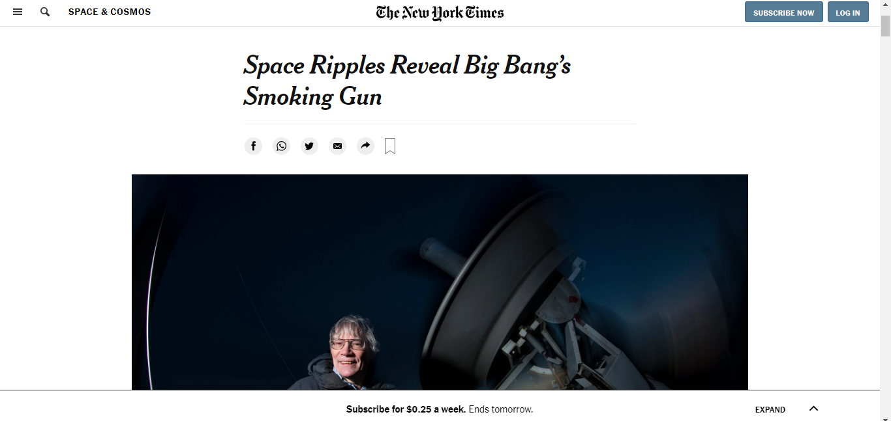
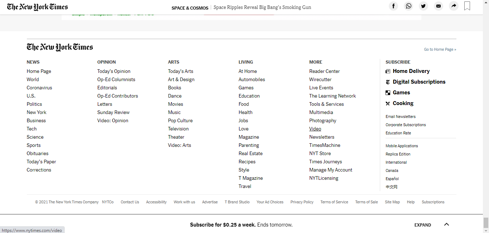

# first-project-microverse

> This is a clone of the New York Times Article.
To view it, click [here](http://127.0.0.1:5500/index.html)
You may view the original page[here](https://www.nytimes.com/2014/03/18/science/space/detection-of-waves-in-space-buttresses-landmark-theory-of-big-bang.html?_r=0)

![Screenshot]

This is the first html-css project in the Microverse curriculum.

## Built With

- Html
- Css

## Live Demo

[Live Demo Link](https://livedemo.com)

## Author

👤 **Lilian Moraa**

- GitHub: [@githubhandle](https://github.com/lily-coder)
- Twitter: [@twitterhandle](https://twitter.com/LilianM53742529)
- LinkedIn: [LinkedIn](https://www.linkedin.com/in/lilian-moraa-99950b1b8)

## 🤝 Contributing

Contributions, issues, and feature requests are welcome!

Feel free to check the [issues page](../../issues/).

## Show your support

Give a ⭐️ if you like this project!

## Acknowledgments

- Hat tip to anyone whose code was used
- Inspiration
- etc
